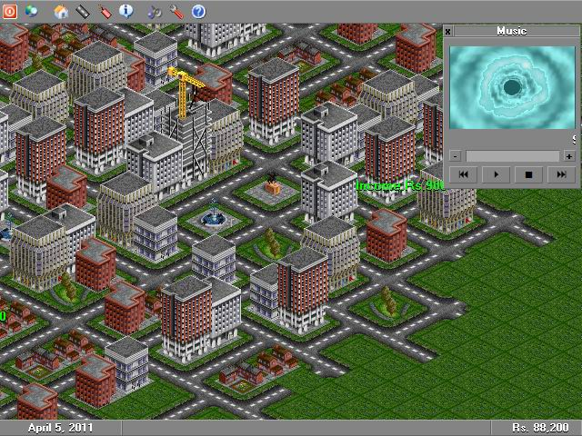

## \[FA\] City Builder \[v1\.2\]

### Description

A 2D Windows-based game. You can construct various buildings, roads, destroy them, earn money through monthly taxes, scroll around the terrain.... all like a professional strategy game! inspired from my favorite dos-based game Transport Tycoon Deluxe by Chris Sawyer, Micropose. Graphics are drawn on the basis of flicker-free drawing concept. Great frame rate. Ive also made support for full-screen mode. Actually in Full-Screen mode, the game switches the screen resolution to 640x480 size so it wont have to stretch the graphics. Anywayz.. contains load and loads of stuff which i cant even explain here. Ive got some great great stuff for amateur programmers. I was planning to make a proper game out of it but the frame rate didnt supported enough and im no good at directx so i kept the game only to a little coding demonstration. Try it out dudes!!! plz vote.. means very much to me! .... IMPORTANT: Please please dont forget to read the README.TXT file first to see the recommended system requirements for this game. [UPDATIONS]: Load/Save map, better framerate, new effect on selecting buildings.
 
### More Info
 

             |
---                |---
**Submitted On**   |2004-12-16 01:11:50
**By**             |[Faraz Azhar](https://github.com/Planet-Source-Code/PSCIndex/blob/master/ByAuthor/faraz-azhar.md)
**Level**          |Advanced
**User Rating**    |5.0 (607 globes from 122 users)
**Compatibility**  |VB 6\.0
**Category**       |[Games](https://github.com/Planet-Source-Code/PSCIndex/blob/master/ByCategory/games__1-38.md)
**World**          |[Visual Basic](https://github.com/Planet-Source-Code/PSCIndex/blob/master/ByWorld/visual-basic.md)
**Archive File**   |[\[FA\]\_City\_18298612162004\.zip](https://github.com/Planet-Source-Code/faraz-azhar-fa-city-builder-v1-2__1-57486/archive/master.zip)

